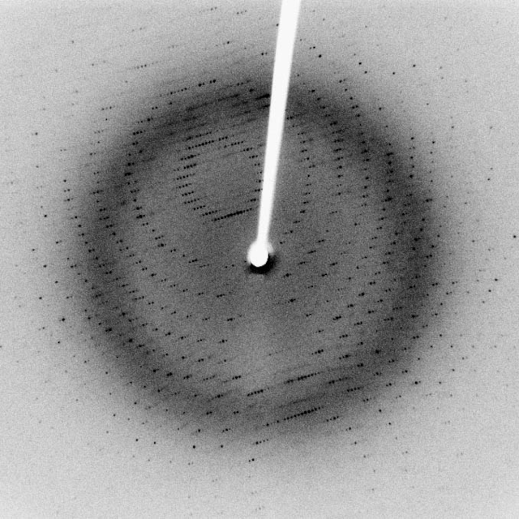
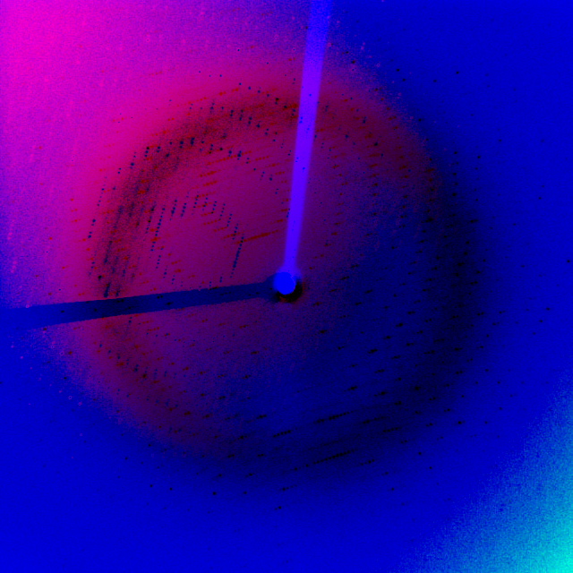

# lattice-dft thing

very shitty DFT application over a grayscale image

miller indices??? never heard of em (todo: actually implement them)

By Jeff Dahl - Own work, CC BY-SA 3.0, [https://commons.wikimedia.org/w/index.php?curid=3020011]

